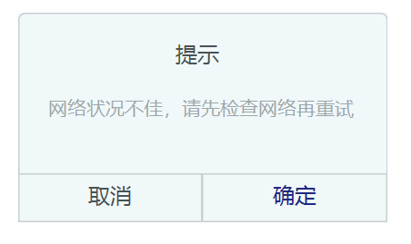

# 春华秋实 微信小程序需求文档 

## 概述

### 版本修订记录

| 文档版本 | 修订日期  |     描述     |          备注          | 修改人 |
| :------: | :-------: | :----------: | :--------------------: | :----: |
|   V1.0   | 2021/3/23 | 创建需求文档 | 功能性需求说明有待完善 | 王子悦 |
|          |           |              |                        |        |
|          |           |              |                        |        |

### 产品介绍

|        属性        |                             内容                             |
| :----------------: | :----------------------------------------------------------: |
|      产品名称      |                         NJU春华秋实                          |
| 产品slogan（待定） | 结合气象知识，科普农业保险产品，参与乡村振兴实业，在实践中历练成长！ |
|      产品定位      |      对接各个组的实践结果，将实践成果在小程序上直观展示      |
|      产品描述      | 用于向农户或从事种植业组织和个人普及农业气象保险的相关知识、提供个性化建议、保障收益、助力脱贫攻坚的微信小程序 |
|       关键词       |                  脱贫攻坚 乡村振兴 农业保险                  |
|      目标人群      |       农作物种植户、有意向了解气象保险的团体组织和个人       |

## 产品结构

### 信息结构图

待完善，详见xmind文件

### 功能结构图

## 全局说明

### 名词解释

| 名称 | 说明 |
| :--: | ---- |
|      |      |
|      |      |
|      |      |
|      |      |

### 时间规范

### 异常情况

### 可视化模板

https://echarts.apache.org/zh/index.html

### 参考样式

https://developers.weixin.qq.com/miniprogram/design/#%E5%8F%8B%E5%A5%BD%E7%A4%BC%E8%B2%8C

## 功能性需求说明

### 启动页模块

#### 参考样式（未完成，只是实例图片）

#### 用户场景

#### 功能描述

- 
-  
-  

#### 交互

-  
-  
-  

