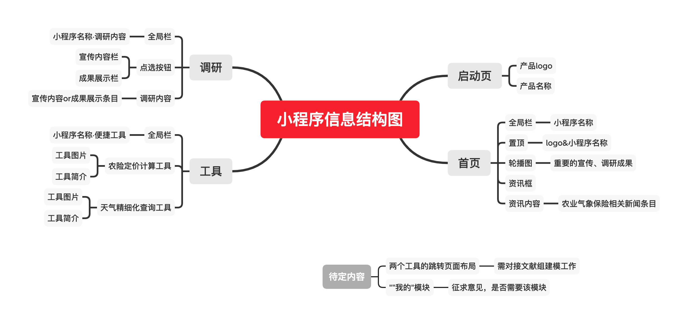

# 春华秋实 微信小程序开发文档 

## 概述

### 版本修订记录

| 文档版本 | 修订日期  |                             描述                             |                  备注                  |    修改人     |
| :------: | :-------: | :----------------------------------------------------------: | :------------------------------------: | :-----------: |
|   V1.0   | 2021/3/23 |                         创建需求文档                         |         功能性需求说明有待完善         |    王子悦     |
|   V1.1   | 2021/3/23 | 1.更新功能性需求、需求说明 2.更新信息结构图 3.指出首页存在的布局问题 | 1.“我的”模块待定2.跳转后的页面布局未定 | 王子悦 张刘洋 |
|          |           |                                                              |                                        |               |

### 产品介绍

|        属性        |                             内容                             |
| :----------------: | :----------------------------------------------------------: |
|      产品名称      |                         NJU春华秋实                          |
| 产品slogan（待定） | 结合气象知识，科普农业保险产品，参与乡村振兴实业，在实践中历练成长！ |
|      产品定位      |      对接各个组的实践结果，将实践成果在小程序上直观展示      |
|      产品描述      | 用于向农户或从事种植业组织和个人普及农业气象保险的相关知识、提供个性化建议、保障收益、助力脱贫攻坚的微信小程序 |
|       关键词       |                  脱贫攻坚 乡村振兴 农业保险                  |
|      目标人群      |       农作物种植户、有意向了解气象保险的团体组织和个人       |

### 项目地址

>https://github.com/Wzy-source/NJU-Fruitful-Mini-Program

## 产品结构

### 1.信息结构图

**详见xmind文件**

### 2.功能结构图

**详见xmind文件**

## 全局说明

### 1.名词解释

|     名称     |                             说明                             |
| :----------: | :----------------------------------------------------------: |
| 小程序全局栏 |    微信小程序自带且必须包含的顶部样式，仅能展示文字性说明    |
|     条目     | 包含图片、名称、内容概要（作者、时间）点击条目，页面跳转至详情内容 |
|              |                                                              |
|              |                                                              |

### 2.小程序官方文档

https://developers.weixin.qq.com/miniprogram/dev/framework/

### 3.可视化模板

https://echarts.apache.org/zh/index.html

## 功能性需求说明

### 1.启动页模块

#### 参考样式

#### 用户场景

  **注意，该页面格式由微信指定，仅能展示logo和小程序名称**

>用户点击小程序图标or链接，启动小程序时的展示页面

#### 功能描述

> - 打开小程序启动页，并跳转至微信小程序首页

#### 交互

>- 无

### 2.全局底部按钮

#### 参考样式

#### 用户场景

>- 用户使用任何一个模块时，位置固定不变的模块按钮

#### 功能描述

>- 点击图标，实现模块的跳转

#### 交互

>- 按钮的点击
>- 界面横跳转效果

### 3.首页模块

#### 参考样式

来源：新视觉实训小程序首页

#### 用户场景

>- 用户浏览首页的展示页面，提供了重要的实践信息和相关资讯两部分内容

#### 功能描述

>- 顶部：小程序logo和小程序名称
>- 轮播图：用于展示重要的宣传、调研成果，用户可以滑动和点击
>- 资讯框：类似参考样式中的”学生作品“框，用于分隔轮播图和资讯条目
>- 资讯条目：具体与气象保险相关的新闻条目，包含照片（左）和概要性文字（右）两个部分

附：资讯条目参考样式：

#### 交互

>- 滑动轮播图：切换图片和图片对应的资讯
>- 点击轮播图：进入重要的宣传、调研成果的展示页面
>- 上滑屏幕：页面上移，呈现更多的资讯条目

==问题==

首页内容较为单薄，尤其是轮播图和资讯框中间的部分空缺

### 4.调研模块

#### 参考样式

来源：新视觉实训小程序的资讯模块

#### 用户场景

>- 用户浏览调研模块，有宣传内容和成果展示栏目可以选择

#### 功能描述

>- 顶部：宣传内容和成果展示的两个书签栏，点击另一个后切换下方内容
>- 栏目条目：宣传、成果展示相关的条目，包含照片（左）和概要性文字（右）两个部分

#### 交互

>- 点击书签栏实现内容切换
>- 点击栏目条目实现页面跳转，跳转至详情内容
>- 上滑屏幕：页面上移，呈现更多的条目

### 5.工具模块

#### 参考样式

来源：围棋app商城模块

#### 用户场景

>- 用户浏览工具模块，提供了农险定价计算和天气精细化查询两个工具

#### 功能描述

>- 工具条目：农险定价计算和天气精细化查询两个工具条目，左边为工具图，右边为工具名称和工具简介
>- 相较于其他条目样式该条目面积较大，每个条目之间有明显的间隔，提供良好的视觉体验

#### 交互

>- 用户点击工具条目实现页面跳转，跳转具体的工具界面

